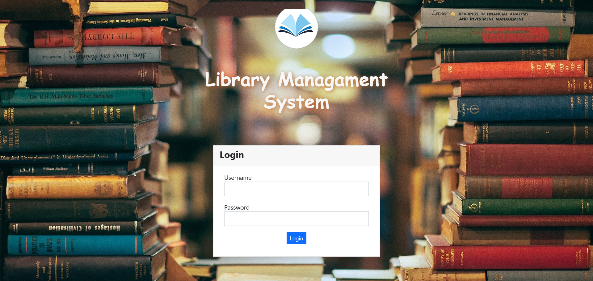
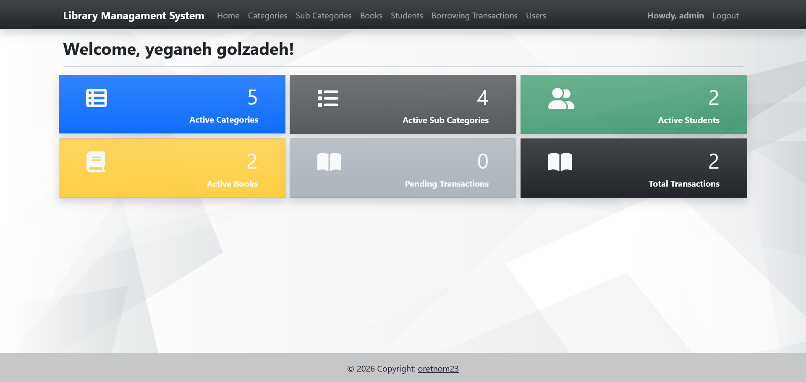
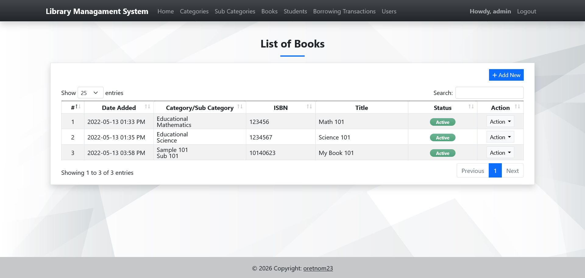
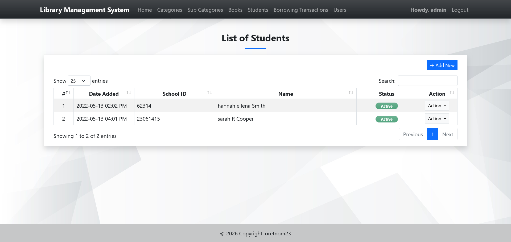

# 📚 Django Library Management System

A complete **Library Management System** built with **Django**.  
Manage books, students/members, borrowing transactions, categories, and users through a simple and practical web interface.

---

## ✨ Features

- **Book Management** — Add, edit, view, and soft-delete books (ISBN, title, author, publisher, publication date, etc.)
- **Student / Member Management** — Register students with personal details, department, and course
- **Borrowing System** — Record book loans and returns (Pending / Returned status)
- **Categories & Sub-Categories** — Organize books hierarchically
- **User Management** — Manage system users, profiles, and passwords
- **Authentication** — Login / Logout with protected views
- **Admin Panel** — Full Django admin support
- **Responsive UI** — Clean templates with DataTables and Select2
- **Static & Media Handling** — WhiteNoise for static files + media uploads (avatars, etc.)
- **Docker Ready** — Includes Dockerfile (also deployable on Hugging Face Spaces)

---
## 📸 Screenshots

> Place your screenshots inside a `screenshots/` folder in the repository root, then update the paths below.

### Login Page


### Dashboard / Home


### Books Management


### Students Management


### Borrowing Transactions


### Categories


---

## 🛠️ Tech Stack

| Technology       | Version / Notes              |
|------------------|------------------------------|
| Python           | 3.11+                        |
| Django           | 4.2.16                       |
| Database         | SQLite3 (included)           |
| Image handling   | Pillow                       |
| Static files     | WhiteNoise                   |
| Production server| Gunicorn                     |
| Container        | Docker                       |
| Frontend extras  | DataTables, Select2          |

---

## 🔑 Default Login Credentials

| Field      | Value      |
|------------|------------|
| **Username** | `admin`    |
| **Password** | `admin123` |

> If these credentials do not work, create a new superuser with:
> ```bash
> python manage.py createsuperuser
> ```

---

## 🚀 Quick Start (Local)

### 1. Clone the repository
```bash
git clone https://github.com/YOUR_USERNAME/django-library-management.git
cd django-library-management
```

### 2. Create a virtual environment (recommended)
```bash
python -m venv venv

# Windows
venv\Scripts\activate

# macOS / Linux
source venv/bin/activate
```

### 3. Install dependencies
```bash
pip install -r requirements.txt
```

### 4. Apply migrations
```bash
python manage.py migrate
```

### 5. Run the development server
```bash
python manage.py runserver
```

Open your browser and go to:  
**http://127.0.0.1:8000**

---

## 🐳 Run with Docker

```bash
# Build the image
docker build -t django-lms .

# Run the container
docker run -p 7860:7860 django-lms
```

The application will be available at:  
**http://localhost:7860**

> The Dockerfile is configured for Hugging Face Spaces (port `7860`).  
> For local use you can change the port mapping as needed.

---

## 📁 Project Structure

```
django_lms/
├── django_lms/          # Project settings
│   ├── settings.py
│   ├── urls.py
│   ├── wsgi.py
│   └── asgi.py
├── lmsApp/              # Main application
│   ├── models.py        # Category, SubCategory, Books, Students, Borrow
│   ├── views.py
│   ├── urls.py
│   ├── forms.py
│   ├── admin.py
│   ├── templates/       # HTML templates
│   ├── templatetags/
│   └── migrations/
├── media/               # Uploaded files (avatars, etc.)
├── static/              # CSS, JS, DataTables, Select2
├── db.sqlite3           # SQLite database (demo data included)
├── manage.py
├── requirements.txt
├── Dockerfile
└── README.md
```

---

## 📊 Data Models Overview

| Model         | Description                                      |
|---------------|--------------------------------------------------|
| **Category**  | Main book categories (Active / Inactive)         |
| **SubCategory** | Sub-categories linked to a Category            |
| **Books**     | Books with ISBN, title, author, publisher, etc.  |
| **Students**  | Library members (name, contact, department, course) |
| **Borrow**    | Borrowing transactions (Pending / Returned)      |

Soft-delete is implemented via a `delete_flag` field on most models.

---

## 📦 Requirements

```
Django==4.2.16
Pillow==10.4.0
whitenoise==6.7.0
gunicorn==22.0.0
```

---

## ⚠️ Important Notes

- This project is configured with `DEBUG = True` and is intended for **demo / development** use.
- The included `db.sqlite3` already contains sample data and the default admin user.
- Media files and the database are stored inside the project directory.
- Before deploying to production:
  - Set `DEBUG = False`
  - Change `SECRET_KEY`
  - Configure proper `ALLOWED_HOSTS`
  - Consider using PostgreSQL or another production database
  - Serve media files properly (not via Django)

---

## 🤝 Contributing

Contributions, issues, and feature requests are welcome!  
Feel free to fork the repository and submit a pull request.

1. Fork the project
2. Create your feature branch (`git checkout -b feature/AmazingFeature`)
3. Commit your changes (`git commit -m 'Add some AmazingFeature'`)
4. Push to the branch (`git push origin feature/AmazingFeature`)
5. Open a Pull Request

---

## 👩‍💻 Author

**Yeganeh Golzadeh**

GitHub: [@yegolzadeh](https://github.com/yegolzadeh)
Email: [yegolzadeh01@gmail.com](yegolzadeh01@gmail.com)
---

## 📄 License

This project is intended for educational and development purposes.

If you plan to distribute or use the project commercially, consider adding an appropriate open-source license such as the MIT License.
